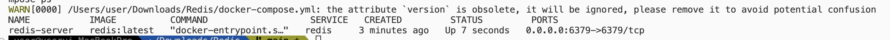
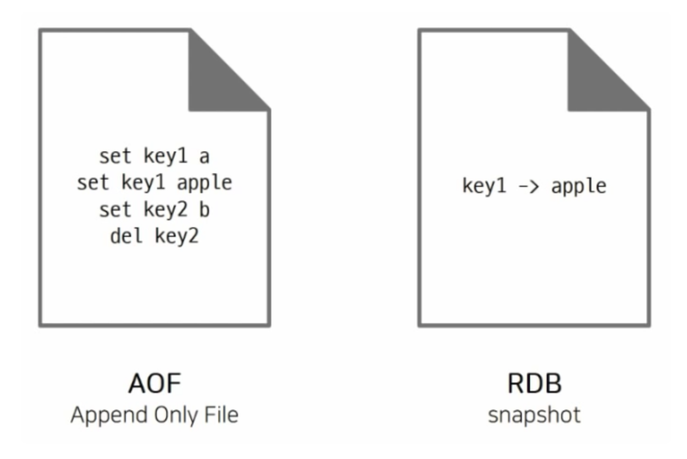

# Redis 기초부터 활용까지
## 학습 과정
1. 기본 구조(Key-Value) 및 Get, Set 사용법 [o]
2. Redis를 사용하는 API 구축 [o]
3. Keysapce와 Redis의 메모리 관리 방식 [o]
4. 데이터 영속화(AOF, RDB) [ㅅ]
5. Indexing과 Caching 활용 [] 
    - Redis를 캐싱 계층으로 사용해 데이터베이스의 성능 향상
6. TTL와 LRU 알고리즘 이해 []
7. 기타 자료구조 활용 (Hsah, List, Set, Sorted Set) []
8. 캐싱 정책 - 정적/동적 캐싱 차이 []
9. Cahce Stampede 방지 - 잠금 캐싱 []
10. Lock 구현 및 동시성 이슈 해결 []
11. SETNX와 EXPIRE로 분산 LOCK 구현 []
12. Redlock 알고리즘으로 데이터 정합성 보장 []
13. 여러 사용자가 동시에 접근할 때 생길 수 있는 데이터 충돌 해결 []
14. Redis 트랜잭션(MULTI/EXEC) []
15. Lua 스크립트를 활용한 Lock 구현 []
16. Distributed Consensus 알고리즘 (ex. Paxos, Raft) []
17. Rate limit으로 서버 리소스 관리 []
18. Redis를 활용한 트래픽 제한을 통해 서버 안정성을 확보 []
19. INCR 명령어와 Sliding Window 알고리즘으로 요청 제한 []
20. Rate Limiting을 통해 API 호출 빈도 제어 []
21. 서버 부하 방지를 위해 사용자별 제한 설정 []
22.Token Bucket, Leaky Bucket 알고리즘 []
23. Redis Pub/Sub을 통한 실시간 알림 시스템 구현 []
24. Redis Streams를 활용한 데이터 스트리밍 []
25. Redis 운영 및 확장 []
26. Replication(복제): 읽기 성능 최적화, master-slave 구조 []
27. Cluster 모드: 분산 시스템에서 확장성을 지원 []
28. Persistence(영속성): RDB 스냅샷과 AOF(append-only file)로 데이터 복원 []
29. Pub/Sub: 실시간 채팅, 알림 구현 []
30. Redis Streams: 로그 처리, 이벤트 소싱 []
31. RedisBloom: Bloom 필터로 효율적 데이터 필터링 []
32. 보안과 성능 
  - Redis 인증 및 사용자 관리 []
33. Redis의 성능 모니터링(RedisInsight, INFO 명령어) []
34. 메모리 최적화 기법 []

# Docker 를 이용한 Redis 세팅

1. 도커에 Redis를 설치한다
    
    ```jsx
    docker --version // 도커가 설치되어 있는지 확인
    ```
    
2. docker-compose.yml 작성
    
    ```jsx
    version: '3.8' # Docker Compose 버전
    services:
      redis:
        image: redis:latest # Redis Docker 이미지
        container_name: redis-server # 컨테이너 이름
        ports:
          - "6379:6379" # 호스트:컨테이너 포트 바인딩
        volumes:
          - redis-data:/data # 데이터 영속성을 위한 볼륨 마운트
        command: ["redis-server", "--appendonly", "yes"] # Redis 설정 변경 (예: 영속성 활성화)
    
    volumes:
      redis-data: # 데이터 저장 볼륨
    
    ```
    
3. docker-compose 실행
    
    ```jsx
    docker-compose up -d
    ```
    
4. 실행 확인
    
    ```jsx
    docker ps // 실행중인 프로세스 중에 redis가 있는지 확인
    ```
    
    
    
5. redis-cli를 통한 연결 가능
    
    ```jsx
    docker exec -it redis-server redis-cli
    ```
    
6. 데이터 영속성 확인
    - docker-compose.yml에서 설정한 redis-data 볼륨을 사용하면 Redis 데이터를 컨테이너가 종료되어도 저장 가능
    
    ```jsx
    docker volume inspect redis-data
    ```
    

# 기본 사용법

```jsx
// 키 가져오기
Get keyname
// 모든 키 가져오기
Keys *
// 키 넣기
Set keyname data
// 키 삭제
del keyname
// 키 스페이스 정보
info keyspace
// 메모리 정보 확인
Memory Stats
```

# **Keyspace와 Redis의 메모리 관리 방식**

## Redis에서 키를 관리하는 방법

키 유효시간

스캐닝

altering

qurying

binary safe하기 때문에 어떤 binary sequence든 키로 사용할 수 있다

## 키 규칙

매우 긴 키는 좋지 않다. 큰 값 매칭이 필요하다면 해싱하는 것이 좋다

메모리 관점

키를 비교하는 비용 관점

매우 짧은 키 또한 종종 좋은 방법은 아니다

가독성 측면

ex) user:1000:folowers를 u1000flw로 줄이는 것은 메모리를 아주 조금 줄여줄 뿐이다.

스키마 형태로 작성하는 것을 권장한다

ex) object-type:id 형태 (user:1000)

. 이나 -를 사용해 multi-word field를 작성할 수 있다

최대 키 사이즈는 512MB이다

## Altering and querying the key space

### EXISTS

0, 1로 존재 여부를 알려줌

있다 == 1

없다 == 0 

### DEL

삭제 성공 여부를 숫자로 알려 준다.

성공 == 1

실패 == 0

### TYPE

타입을 알려준다.

type 반환

없으면 == none

## Key expiration

키에 대한 TTL(Time To Live)를 설정할 수 있다

second, millisecond로 설정할 수 있다

expire 정보는 redis에 저장된다

```jsx
> set code 123 EX 30 // code의 만료기간은 30초이다
> time // 이 명령어를 통해 ms단위로 몇 초 남았는지 알 수 있다
```

### 메모리 관리

Redis는 LRU (Least Recently Used) 알고리즘을 사용해 메모리를 관리한다.

# 데이터 영속화 (RDB, AOF)



Redis는 In-memoryDB임에도 불구하고 메모리 데이터를 disck에 저장할 수 있다

서버를 껐다 켜도 disk에 저장한 데이터를 다시 읽어 메모리에 로딩시켜 데이터 유실을 방지할 수 있다.

이런 영속성 기능은 휘발성 메모리 DB를 데이터 스토어로 활용한다는 장점이 있지만 이 기능 때문에 `장애의 주원인`이 되기도 한다.

## RDB

관계형 DB를 줄인 말이 아니다

Redis DB의 줄인말이다

이 방법은 지정된 간격으로 데이터의 스냅샷을 찍어 저장한다

즉, 현재 메모리에 저장된 데이터 상태들을 특정 시점에 저장하는 방법

### 장점

RDB는 매우 압축된 특정 시간에 대한 메모리 상태(데이터)를 나타낸다.

ex) 시간마다 또는 매일 스냅샷을 통해 Redis에 정애가 발생한 경우 원하는 특정 지점의 데이터를 복구할 수 있다

스냅샷은 바이너리 형태로 저장이 되어 직접 읽을 순 없다

별도의 저장소로 보낼 수 있는 `단일 압축 파일`이기 때문에 재해 복구에 좋다

### 단점

데이터 손실을 최소화 해야 하는 경우 좋지 않다.

특정 시간마다 현재의 메모리 데이터 스냅샷을 찍어 영속화하기 때문

### RDB 설정 항목

| 설정 항목 | 설정 사례 | 설명 |
| --- | --- | --- |
| save | 900 1 | 900초(15분) 이후 1개의 쓰기 발생 |
| save | 300 10 | 300초(3분) 이후 10개의 쓰기 발생 |
| save | 60 10000 | 60초 이후 10,000개의 쓰기 발생시 디스크에 데이터 복제 |
| stop-writes-on-bgsave-error | yes | - RDS 스냅샷 중 쓰기 요청 중단옵션 
- 레디스 서버 및 Disk 지속서에 대한 적절한 모니터링 체계를 갖췄다면 ‘no’로 지정해 사용 가능 |
| rdbcompression | yes | dump.rds 파일을 LZF로 압축 |
| rdbchecksum | yes  | - CRC64로 Checksum 값 생성후 dump.rds 파일에 추가
- 데이터 영속성 보장이 강화되나 10% 정도의 성능 오버헤드 발생 |
| dbfilename | dump.rdb | 변경 지정 가능 |
| dir | ./ | dump.rdb 파일과 AOF 파일 생성 위지 |

## 저장 시점 정하기

저장 방식에는 SAVE와 BGSAVE 두가지가 있다

`SAVE`

순간적으로 redis의 동작을 정지시키고 그 snapshot을 디스크에 저장.(blocking 방식)

동작 순서

1. Main process가 데이터를 새 RDB temp 파일에 쓴다.
2. 쓰기가 끝나면 기존 파일을 지우고, 새파일로 교체한다.

`BGSAVE`

백그라운드 SAVE라는 의미로 별도의 자식 프로세스를 띄운 후, 명령어 수행 당시의 snapshot을 저장하고, redis는 동작을 멈추지 않게 된다. (non-blocking 방식)

동작순서

1. Child process를 fork()한다.
2. Child process는 데터를 새 RDB temp 파일에 쓴다.
3. 쓰기가 끝나면 기존 파일을 지우고, 이름을 변경한다.

SAVE 조건은 여러 개를 지정할 수 있고, AND || OR 이다

즉, 어느 것 하나라도 만족하면 저장한다.

만일 RDB 저장을 사용하지 않으려면 redis.conf에서 SAVE를 모두 주석 처리하면 된다.

> BGSAVE 방식은 fork를 하기 때문에 메모리를 거의 두 배 가량 사용하므로 이에 주의해야 한다.
> 

```jsx
save [Seconds][Changes]
save 900 1 // 900초(15분) 동안 1번 이상 key 변경이 발생하면 저장
save 300 10 // 300초(5분) 동안 10번 이상 key 변경이 발생하면 저장
save 60 10000 // 60초(1분) 동안 10,000번 이상 key 변경이 발생하면 저장
```

### RDB 파일명 지정

디렉토리는 dir로 지정된 워킹 디렉토리를 따른다.

```jsx
dbfilename dump.rdb
```

### RDB 저장 실패시 데이터 읽기 여부

RDB 파일 저장이 실패했을 경우 데이터를 받아 들일지 말지를 정하는 파라이터

```jsx
stop-writes-on-bgsave-error yes
```

이 값이 `yes`일 때, 레디스는 RDB 파일을 디스크에 저장하다 실패하면, 모든 쓰기 요청을 거부한다. `Default는 yes`이다

이 값을 `no` 로 설정하면 디스크 저장에 실패하더라도, 레디스는 쓰기 요청을 포함한 모든 동작을 정상적으로 처리한다.

디스크 쓰기에 실패하는 경우는 여유 공간이 부족하거나, 권한(permission) 부족, 디스크 물리적 오류 등이 있을 수 있다.

이 파라미터는 `SAVE 이벤트에만 해당`한다. BGSAVE 명령을 직접 입력했을 때는 해당 x

## AOF (Append Only File)

Write 작업이 일어날 때마다 File에 로그처럼 해당 명령이 기록 된다.

Redis가 살아났을 때 기록된 write작업을 다시 재생해서 복구한다.

### 장점

쓰기 작업마다 기록이 되기 때문에, 데이터 손실률이 RDB보다 현저히 적다

FLUSH ALL 명령어를 실수로 사용한 경우 AOF 파일에 기록된 FLUSH ALL만 제거하고, 서버를 재시작하면, 가장 최신의 데이터 상태로 복구가 가능한다.

### 단점

동일한 시점의 데이터라도 RDB보다 AOF가 더 크다

RDB보다 AOF가 더 느리다

### AOF Rewrite

Rewrite는 현재 AOF에 기록된 write 작업을 통해 가장 최근의 데이터로 복구하기 위해 필요한 최소한의 작업이 기록된 새로운 파일은 만드는 것을 뜻함

백그라운드에서 rewrite 작업이 일어나게 된다

즉, 백그라운드에서 rewrite를 하고, 이를 현재 레디스가 기록중인 AOF 파일과 전환한다.

### Fsync

운영체제 버퍼에서 실제 디스크로 저장하도록 하는 명령어

`always`

새로운 명령이 AOF에  추가될 때마다 fsync를 수행한다.

매우 느리다

`every sec`

매초마다 fsync를 수행한다.

충분히 빠르다

`no`

OS에게 fsync를 맡긴다.

Linux는 보통 30초마다 fsync를 한다.

## 어떤 것을 골라야 하는가

### RDS

재해 발생시 몇 분 정도의 데이터 손실을 감수할 수 있다면 RDS만 단독으로 사용가능

### AOF

데이터 손실을 최소화 해야 하는 경우 사용한다.

AOF만 사용하는 경우, 명령어를 모두 다시 실행해야 하기 때문에, 데이터를 복구하는 시간이 오래 걸릴 수 있다. 따라서 RDS를 같이 사용하는 것이 좋다.

# 출처

[Redis - 영속화(Persistence)](https://galid1.tistory.com/799)

[[REDIS] 📚 캐시 데이터 영구 저장하는 방법 (RDB / AOF)](https://inpa.tistory.com/entry/REDIS-%F0%9F%93%9A-%EB%8D%B0%EC%9D%B4%ED%84%B0-%EC%98%81%EA%B5%AC-%EC%A0%80%EC%9E%A5%ED%95%98%EB%8A%94-%EB%B0%A9%EB%B2%95-%EB%8D%B0%EC%9D%B4%ED%84%B0%EC%9D%98-%EC%98%81%EC%86%8D%EC%84%B1)